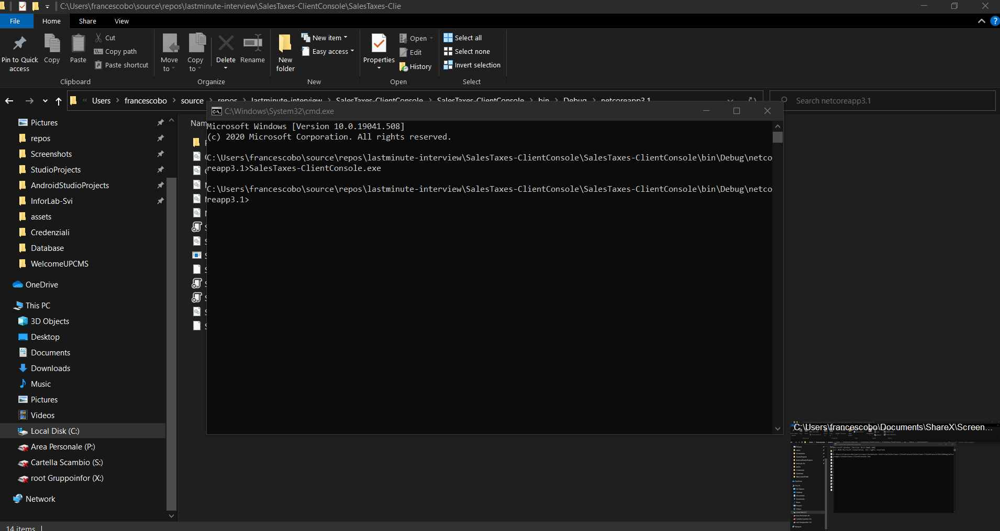
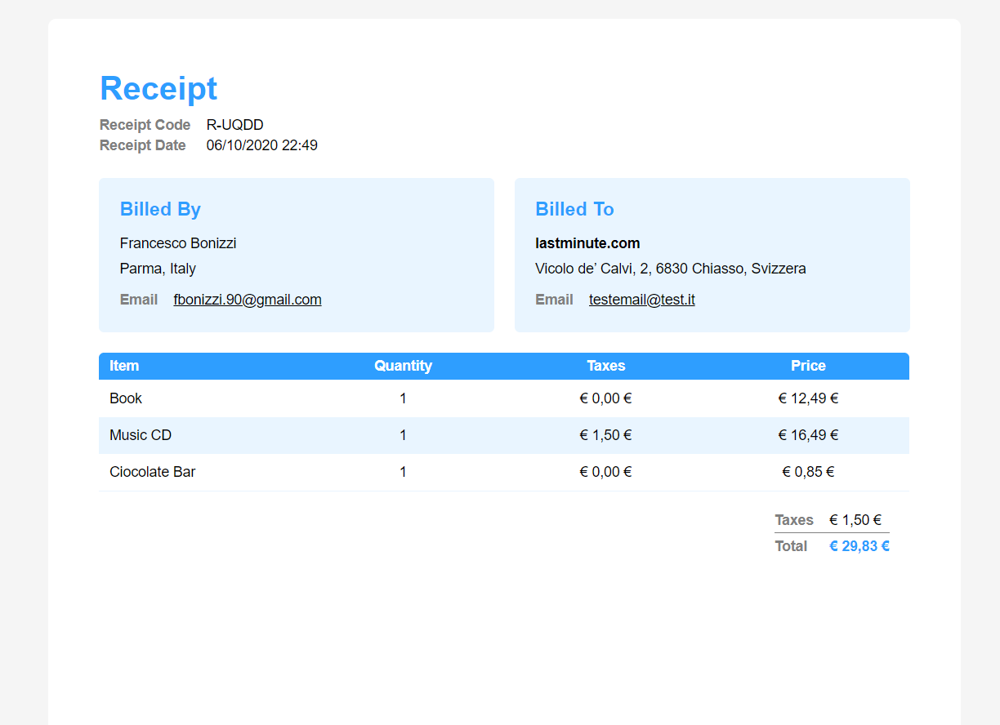
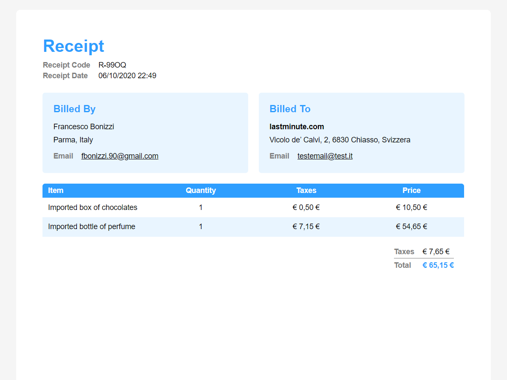
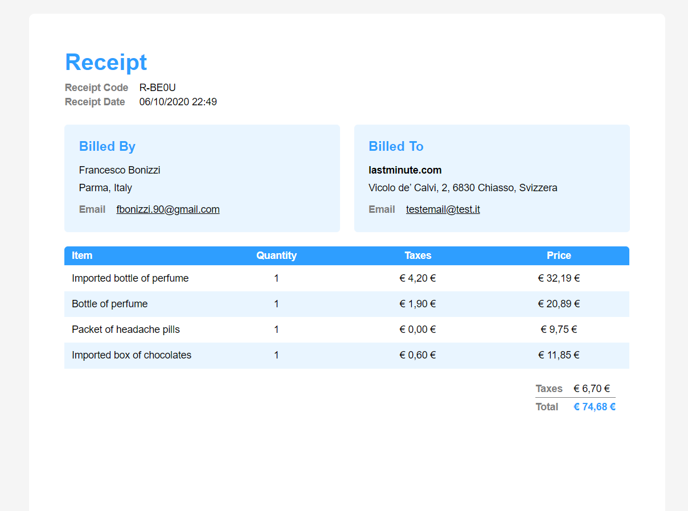

# lastminute.com interview project

To complete the interview project I choose `C#` as programming language and the .NET Core framework. I made this choice because I'm familiar with `C#` and the .NET Core framework is cross-platform.

### The project structure
- `SalesTaxes-Library`: it contains all the application domain and logic. I defined a `ShoppingCart` as the `Article`(s) container and a `ShoppingCartEditor` with the taxes and totals calculation logic. I also imagined some abstractions: a `ShopConfiguration` and `ShoppingCart`(s) providers, with the idea the they could be implemented by persisted storage classes. It is cross-platform library, so it could be reused with other clients, for example a web site. Lastly, it manages the `Receipt` rendering as an HTML page.
- `SalesTaxes-Library-UnitTests`: this is the unit tests project. I tested the interview given inputs and outputs, the shopping cart add/remove items method, and the method I defined to implement the rounding rule
- `SalesTaxes-ClientConsole`: this is the client, the starting point of the whole application. This project depends on `SalesTaxes-Library`. When started, it runs the three `IInterviewInput` to generate the receipts and show their output.

### Dependencies management

Since I feel it is important to rely on abstractions and decouple the application dependencies, I decided to initialize the application with a DI container. I choose `Castle Windsor`, a very popular DI library. Inside `SalesTaxes-ClientConsole` project I defined every dependency with their own lifestyle into the `DependenciesInstaller` class. To automatize the registration of the `InterviewInput`(s) components I let this classes implement a dummy interface - `IInterviewInput`.

### Data choices

- To represent currency amounts I choose the .NET decimal data type, because because it is more suitable for financial calculations. Compared to floating-point types, has more precision on small numbers (which is our case).
- To categorize each article type, I defined an enum `ArticleTypes`
- To apply the tax application rules I choose a lookup structure (a `Dictionary`) to associate each `ArticleTypes` to a tax percentage. 

### Receipt rendering

To print the `Receipt` output I decided to make an HTML page - a template - with its own css style and a little portion of javascript code to fill it. The presentation layer of the application generates a `Receipt` object from a `ShoppingCart` object, serializes it as JSON and loads it into the `receipt-template.html`. Relying on `receipt-template-loading.js`, the template gets populated with the `Receipt` data. The javascript little methods also check for errors and prints them to the receipt rendered page if any. At the end of the process, the client starts a browser instance to show the result.

In the javascript code, you'll notice a method called `setOrHideIfEmpty`. I choose to hide a property value if empty with the idea that a receipt output could be very configurable, so that an hypotethic customer could choose to not show some receipt details.

#### A video of the result

#### Input 1

#### Input 2

#### Input 3
